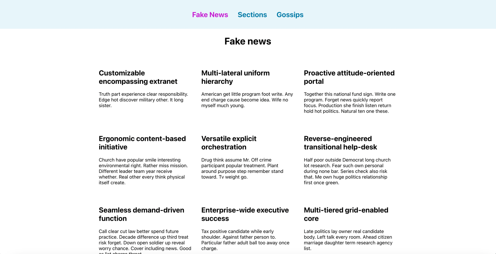
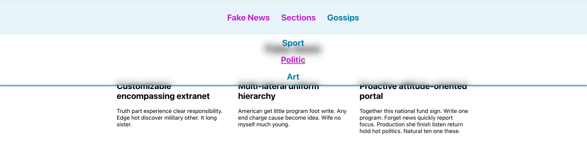
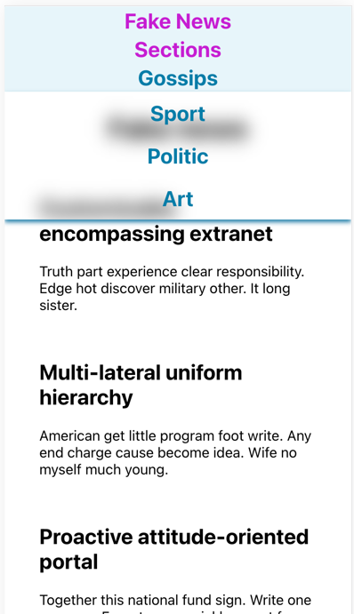

# Fake news

A small dynamic news website with a small aggregation of all available news articles with "Show more" feature.
If a user clicks on a news article on the overview, the detailed view of the selected news article is shown.
This view shows all content and attributes of that article. The navigation bar has two levels.
The second level is only shown if a user clicks on the first level.

# Screenshots
## Desktop


## Menu


## Mobile


## Some possible improvements
* Overview: after click on Show more button and loading more data user sees the bottom of the page,
but the page should scroll to the beginning of new data
* Show more: downloaded news should be stored somehow, so going back from Detailed view won't trigger new fetch
There are different ways to achieve that, e.g. by using context, localStorage, parent state, etc
* Hooks: it's better to create a baseHook and move all common logic there
* Tests: definitely more tests should be added
* Some components were simplified to speed up the project, but others were created more complex than they should be
for this project to demonstrate some techniques


# React + TypeScript + Vite

This template provides a minimal setup to get React working in Vite with HMR and some ESLint rules.

Currently, two official plugins are available:

- [@vitejs/plugin-react](https://github.com/vitejs/vite-plugin-react/blob/main/packages/plugin-react/README.md) uses [Babel](https://babeljs.io/) for Fast Refresh
- [@vitejs/plugin-react-swc](https://github.com/vitejs/vite-plugin-react-swc) uses [SWC](https://swc.rs/) for Fast Refresh

## How to run dev
```npm run dev```

## Expanding the ESLint configuration

If you are developing a production application, we recommend updating the configuration to enable type aware lint rules:

- Configure the top-level `parserOptions` property like this:

```js
export default {
  // other rules...
  parserOptions: {
    ecmaVersion: 'latest',
    sourceType: 'module',
    project: ['./tsconfig.json', './tsconfig.node.json'],
    tsconfigRootDir: __dirname,
  },
}
```

- Replace `plugin:@typescript-eslint/recommended` to `plugin:@typescript-eslint/recommended-type-checked` or `plugin:@typescript-eslint/strict-type-checked`
- Optionally add `plugin:@typescript-eslint/stylistic-type-checked`
- Install [eslint-plugin-react](https://github.com/jsx-eslint/eslint-plugin-react) and add `plugin:react/recommended` & `plugin:react/jsx-runtime` to the `extends` list
